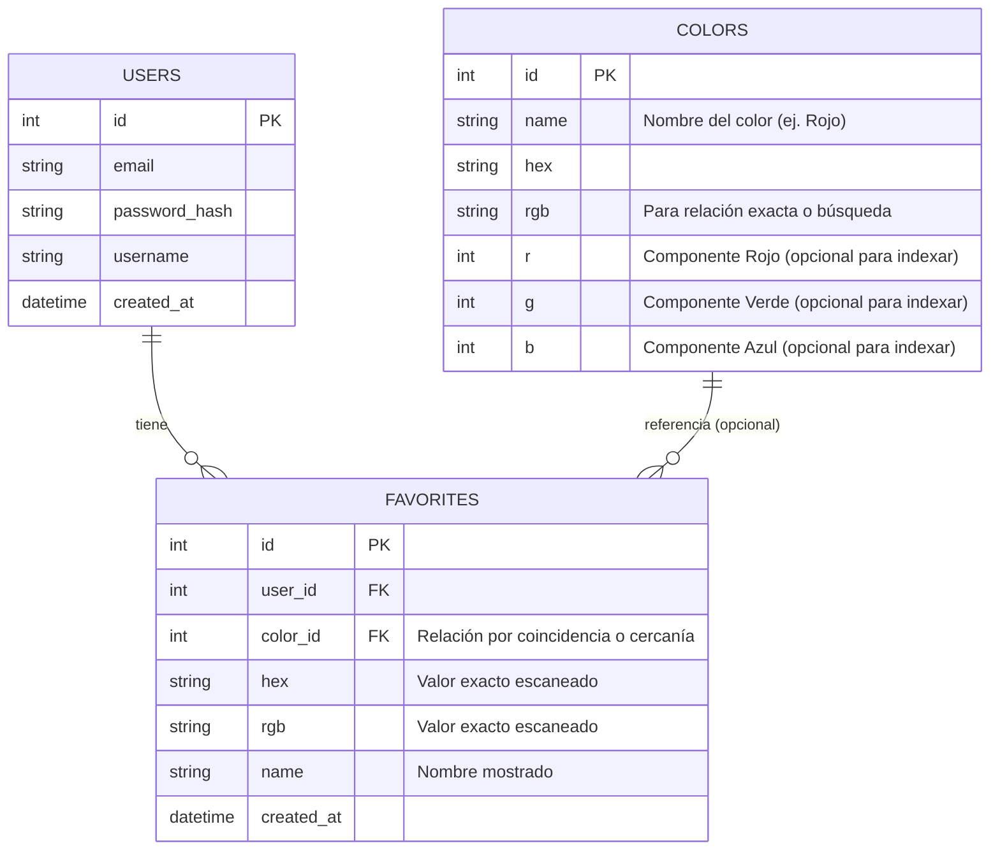

# Diseño de Base de Datos - HueX Mobile

Para hacer la aplicación "HueX Mobile" 100% funcional y soportar las características solicitadas (incluyendo la relación de nombres de colores por código RGB), proponemos el siguiente esquema de base de datos relacional.

## Entidades Principales

### 1. Users (Usuarios)
Necesaria para gestionar perfiles, configuraciones y favoritos de forma individual.
- **id**: Identificador único (UUID o Integer).
- **username**: Nombre de usuario.
- **email**: Correo electrónico (autenticación).
- **password**: Hash de la contraseña.
- **created_at**: Fecha de registro.

### 2. Colors (Catálogo de Colores)
Esta es la tabla solicitada para "relacionar el código RGB con el nombre del color". Actuará como un diccionario maestro de colores.
- **id**: Identificador único.
- **name**: Nombre legible del color (ej. "Rojo Fuego", "Azul Marino").
- **hex**: Código Hexadecimal (ej. "#FF0000").
- **rgb**: Representación en string del RGB (ej. "255,0,0") o columnas separadas `r`, `g`, `b`. *Se recomienda columnas separadas o un formato estándar para facilitar la búsqueda.*
- **cmyk**: Código CMYK.
- **lab**: Código LAB.

### 3. Favorites (Favoritos)
Almacena los colores guardados por el usuario.
- **id**: Identificador único.
- **user_id**: Relación con la tabla `Users` (FK).
- **color_id**: Relación con la tabla `Colors` (FK), opcional. Si el color detectado coincide exactamente con uno del catálogo.
- **hex**: El código hex escaneado (permitimos guardar colores que no estén exactamente en el catálogo).
- **rgb**: El código RGB escaneado.
- **name**: Nombre personalizado o autogenerado.
- **note**: Nota del usuario sobre el color.
- **created_at**: Fecha de guardado.

## Diagrama ER (Entidad-Relación)

## Lógica de Relación RGB -> Nombre

Para cumplir con el requisito de "relacionar una tabla mediante el código RGB que devuelve":

1.  La tabla `Colors` contendrá un listado exhaustivo de colores estándar (ej. CSS Colors, Pantone o similares) con su `rgb`.
2.  Cuando la app detecta un color, devuelve un valor RGB (ej. `120, 50, 200`).
3.  **Opción A (Coincidencia Exacta):** Se realiza una consulta `SELECT * FROM Colors WHERE rgb = '120, 50, 200'`. Si existe, se muestra el nombre.
4.  **Opción B (Búsqueda de Cercanía - Recomendada):** Dado que las cámaras rara vez capturan el RGB exacto de un color digital, se puede buscar el color con la menor distancia Euclideana en el espacio RGB (o mejor aún, Delta E en LAB).

El diagrama soporta ambas opciones, ya que la tabla `Colors` actúa como la fuente de verdad para los nombres.
